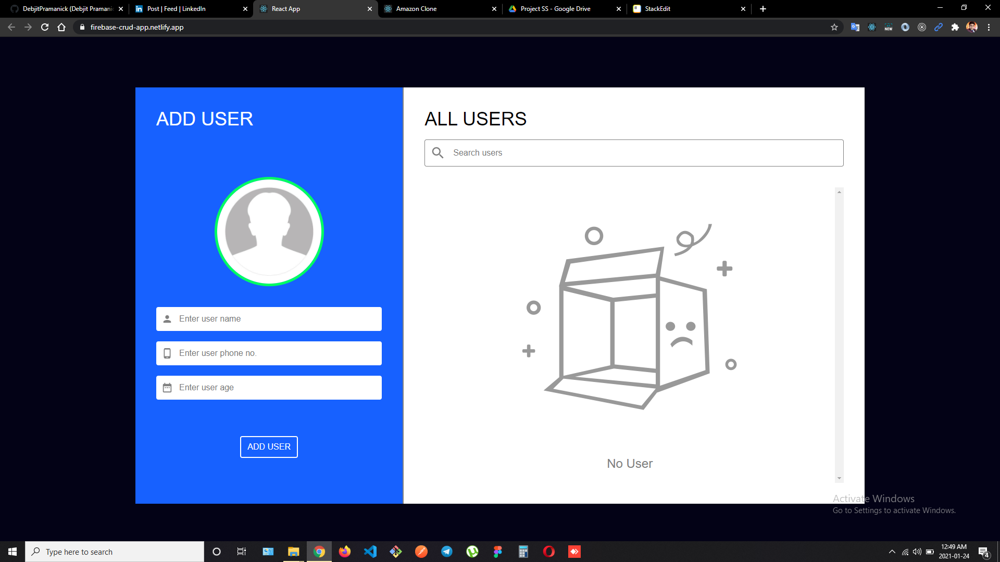
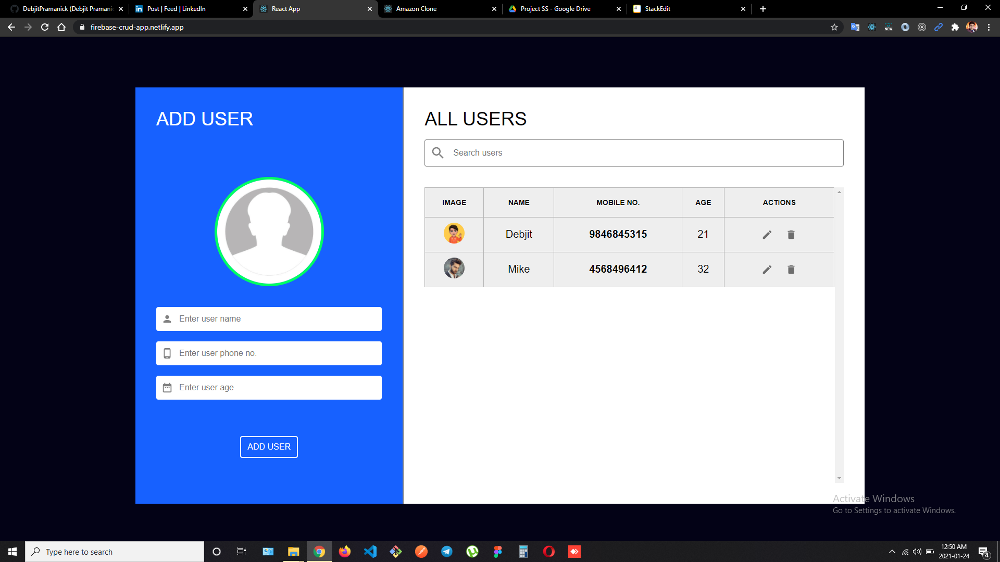

# FIREBASE CRUD APPLICATION

Hi! I'm Debjit, a **MERN Stack Developer**. This is a simple application for creating, updating, deleting and searching datas. I created this project using **React** for frtontend and **Firebase** for storing data.

 

> ### Web App Link - https://firebase-crud-app.netlify.app/

 

## Features

- Creating users with name, phone no. age and an image of user.
- Updating the user dettails.
- Deleting user from databse.
- Searching particular user with their name from the list.

##  NPM Packages Used

- React Image Cropper
- Firebase
- Material UI

## Screenshots

 

